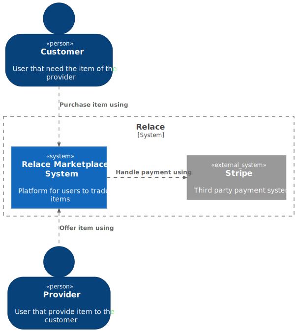
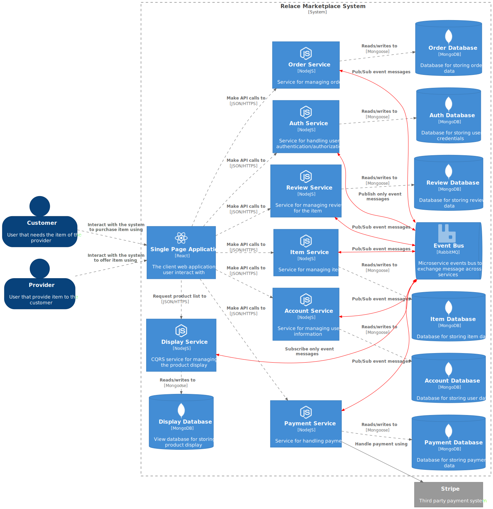

# Overview
The relace system architecture is built on the microservice architecture with its common patterns. Although its unit is still comprised of coarse-grained services, it has improved the  scalability, agility, and reliability of the system while overcoming the shortcomings of the monolithic architecture. As the system grows, it may make sense to further break down the services. 

The event-driven microservices paradigm is used in the communication pattern to enable asynchronicity and loose coupling between services. To accomplish this basic pub/sub messaging is needed. AMQP (RabbitMQ) w/ topic exchange type is chosen in this project.

The diagram depicted in the sections below is loosely based on [C4 Diagram](https://c4model.com/)

## System Context

## Containers

## Common Scenarios

### Sign In

### Create Item

### Order Item
